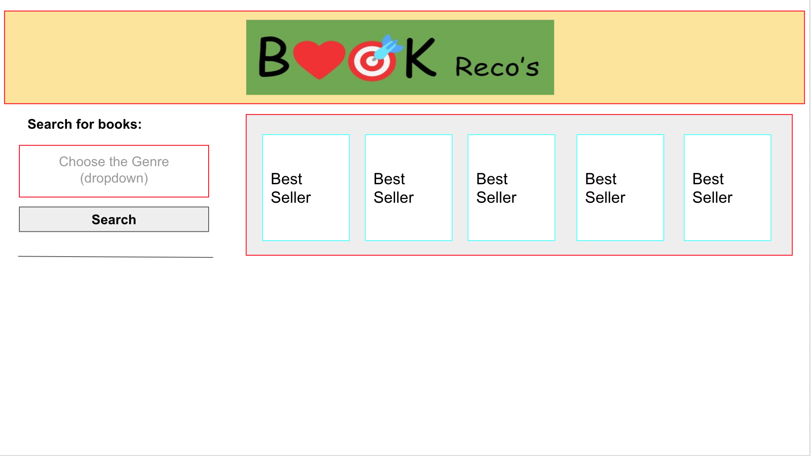

# Book Reco's
# A repository of book recommendations
## Table of Contents
* [Description](#description)
* [Wireframe](#wireframe)
* [Screenshots](#screenshots)
* [Code Snippets](#code-snippets)
* [Technologies Used](#technologies-used)
* [Credits](#credits)
* [Author Links](#author-links)

## Description

Book Reco's offers a simple, easy to use interface to search for books by genre. With Book Reco’s™, each search returns books randomly picked from the whole universe of books belonging to that genre; no repetitions, no skewing towards the popular ones which a fan had probably already read. From the list of recommended books, a book lover can see information and ratings of these books, as well as a summary.The application has been deployed to the Github Pages at [Book Recos](https://sbhikshe.github.io/Book-Recos/).

## Wireframe



## Screenshots
### *1. Initial Screen with form to search for books by genre - shows books from NY Times query*


### *2. Select genre from dropdown box*


### *3. Displaying search results by selected genre from Google Books API*


### *4. Save book to history*


### *5. See More button leads to more information about the book*


## Code Snippets

### 1. Fetch request to get best sellers from New York Times
#### Send out the fetch request to get the NY Time best sellers filtered by a published date. Handle errors and display 5 books randomly picked from the search results.
```
   var requestUrl = "https://api.nytimes.com/svc/books/v3/lists/overview.json?published_date=2022-10-01&api-key=mbr0cIYuEknkV8twRd7HKM3gDlmmsYSA";

    fetch(requestUrl)
        .then(function (response) {
            response.json().then(function (data) {
                console.log(data);
                displayBestSellers(data);
            })
        });
  
```
### 2. Handle the "See More" button
#### When the "See More" button is clicked on one of the books shown, open a new window with a page that has more information about the book.
```
     for (var i = 0; i < 5; i++) {
        if (bookContainerEls[i].moreBtnEl == event.target) {
            /* open in a new tab */
            window.open(bookContainerEls[i].infoUrl, '_blank');
        }
    }
```

## Technologies Used
- HTML
- CSS
- JavaScript
- jQuery
- Tailwind CSS framework
- Daisy UI
- store.js library
- Server Side API - Google Books, New York Times

## Credits
[Google Books API](https://)\
[NY Times Books API](https://developer.nytimes.com/docs/books-product/1/overview)\
[NY Times API to get Best Sellers](https://developer.nytimes.com/docs/books-product/1/routes/lists/overview.json/get)\
[store.js library](https://github.com/marcuswestin/store.js)\
[TBD](TBD)

## Author Links
### LinkedIn: [Peter](TBD) - [Mehmet](TBD) - [Priya](https://www.linkedin.com/in/sripriya-bhikshesvaran-8520992/)
### Github: [Peter](TBD) - [Mehmet](TBD) - [Priya](https://github.com/sbhikshe)
